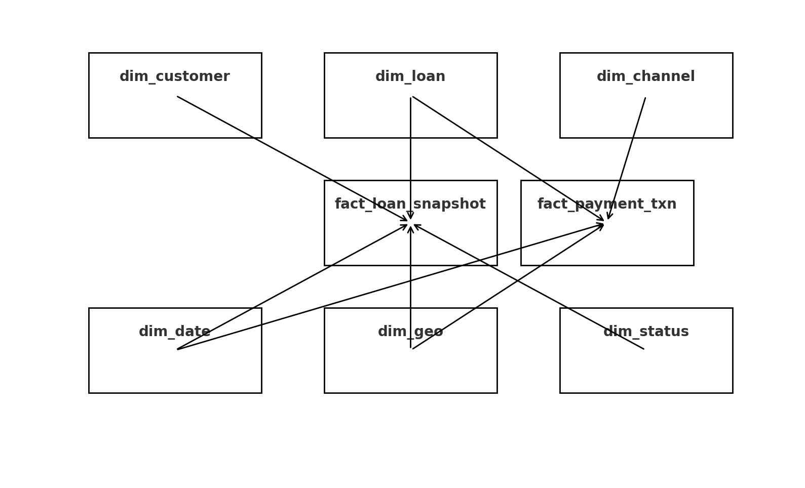
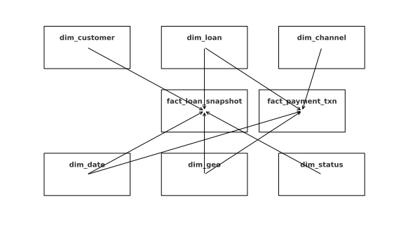

# Loan & Credit Portfolio Analytics Data Warehouse (MySQL)

A complete end-to-end **Loan & Credit Portfolio Analytics Data Mart** project designed using a **star schema** in MySQL.  
This project simulates real NBFC/Bank credit risk analytics including delinquency (DPD), SMA/NPA classification, collection efficiency, and vintage analysis.

---

## 📌 1. Project Overview

This project builds a dimensional data warehouse for analyzing loan portfolios.  
It provides a structure used by NBFCs/Banks for:

- Monitoring portfolio performance
- Tracking overdue loans (DPD)
- SMA/NPA classification as per RBI norms
- Measuring collection efficiency
- Running payment-channel level analysis
- Vintage-based risk analysis

The data mart is BI-ready and can be connected to **Power BI, Tableau, Looker, or Excel**.

---

## 🎯 2. Key Features

- **Star Schema** with 2 fact tables and 6 dimensions
- **Loan Snapshot Fact Table** (DPD, OS, EMI due/paid)
- **Payment Transactions Fact Table** (mode-wise payments)
- **Credit Risk Analytics**: NPA %, SMA %, DPD buckets
- **Collection Metrics**: CE%, roll rates
- **Vintage NPA% Analysis**
- **Full referential integrity** enforced with foreign keys
- **ERD included** (PNG + SVG)

---

## 🏗️ 3. Star Schema Data Model

### **Fact Tables**

#### `fact_loan_snapshot`
Grain: *Loan × Date*  
Stores principal outstanding, interest OS, DPD, EMI due/paid, loan status.

#### `fact_payment_txn`
Grain: *One row per payment*  
Stores payment split (principal, interest, charges), overdue flag, payment channel.

---

### **Dimension Tables**

| Dimension      | Description |
|----------------|-------------|
| `dim_customer` | Customer-level data |
| `dim_loan`     | Loan account details |
| `dim_date`     | Calendar dimension |
| `dim_geo`      | Geography (state/city/branch) |
| `dim_status`   | STD / SMA / NPA / WO / Closed |
| `dim_channel`  | Payment channel (UPI/NACH/Cash etc.) |

---

## 🖼️ 4. ERD (Entity Relationship Diagram)

### **PNG**


### **SVG**


---

## 📁 5. Repository Structure

```
loan-portfolio-analytics/
│
├── sql/
│   ├── schema.sql
│   ├── sample_data.sql
│   ├── analytics_queries.sql
│   └── views.sql
│
├── loan_portfolio_erd.png
├── loan_portfolio_erd.svg
└── README.md
```

---

## 🧱 6. Database Schema (High-Level)

Star schema includes:

- Auto-increment surrogate keys
- Proper foreign key constraints
- Separated fact and dimension tables
- Calendar dimension using YYYYMMDD date keys

Place full SQL scripts in:
```
sql/schema.sql
sql/sample_data.sql
sql/views.sql
sql/analytics_queries.sql
```

---

## 📥 7. Sample Data Overview

Sample dataset includes:

- 3 customers  
- 3 loans (STD, SMA, NPA)  
- One snapshot date: `2025-12-01`  
- Various payment channels  

Example snapshot:

| loan_account | status | dpd | principal_os | emi_due | emi_paid |
|--------------|--------|-----|--------------|---------|----------|
| LN0001       | STD    | 0   | 295000       | 10500   | 10500    |
| LN0002       | SMA    | 45  | 480000       | 13500   | 7000     |
| LN0003       | NPA    | 120 | 730000       | 22000   | 0        |

---

## 📊 8. Analytical SQL Queries

### **8.1 Portfolio Outstanding by Product**
```sql
SELECT
    dl.product_type,
    SUM(fls.principal_os) AS total_principal_os
FROM fact_loan_snapshot fls
JOIN dim_loan dl ON fls.loan_key = dl.loan_key
WHERE fls.date_key = 20251201
GROUP BY dl.product_type;
```

---

### **8.2 NPA Percentage**
```sql
SELECT
    SUM(CASE WHEN ds.status_code = 'NPA' THEN principal_os END)
    / SUM(principal_os) * 100 AS npa_pct
FROM fact_loan_snapshot fls
JOIN dim_status ds ON fls.status_key = ds.status_key
WHERE date_key = 20251201;
```

---

### **8.3 DPD Bucket Analysis**
```sql
SELECT
    CASE
        WHEN days_past_due <= 0 THEN 'Current'
        WHEN days_past_due <= 30 THEN '1-30'
        WHEN days_past_due <= 60 THEN '31-60'
        WHEN days_past_due <= 90 THEN '61-90'
        ELSE '90+'
    END AS bucket,
    SUM(principal_os)
FROM fact_loan_snapshot
WHERE date_key = 20251201
GROUP BY bucket;
```

---

### **8.4 Collection Efficiency**
```sql
SELECT
    SUM(emi_paid_amount) * 100.0 / SUM(emi_due_amount) AS ce_pct
FROM fact_loan_snapshot
WHERE date_key = 20251201;
```

---

### **8.5 Vintage NPA%**
```sql
SELECT
    d.year_num,
    d.month_num,
    SUM(CASE WHEN ds.status_code='NPA' THEN principal_os END) AS npa_amt,
    SUM(principal_os) AS total_amt,
    ROUND(
        SUM(CASE WHEN ds.status_code='NPA' THEN principal_os END)
        * 100.0 / NULLIF(SUM(principal_os),0),2
    ) AS npa_pct
FROM fact_loan_snapshot fls
JOIN dim_loan dl ON fls.loan_key=dl.loan_key
JOIN dim_date d ON dl.disbursement_date_key=d.date_key
JOIN dim_status ds ON fls.status_key=ds.status_key
WHERE fls.date_key=20251201
GROUP BY d.year_num,d.month_num;
```

---

## 📈 9. BI Views (Semantic Layer)

### **vw_portfolio_snapshot**
```sql
CREATE VIEW vw_portfolio_snapshot AS
SELECT
    fls.loan_snapshot_id,
    fls.date_key,
    dd.full_date AS snapshot_date,
    dl.loan_account_number,
    dl.product_type,
    dc.customer_name,
    dg.state,
    dg.city,
    ds.status_code,
    ds.bucket,
    fls.principal_os,
    fls.interest_os,
    fls.charges_os,
    fls.days_past_due,
    fls.emi_due_amount,
    fls.emi_paid_amount
FROM fact_loan_snapshot fls
JOIN dim_date dd ON fls.date_key=dd.date_key
JOIN dim_loan dl ON fls.loan_key=dl.loan_key
JOIN dim_customer dc ON fls.customer_key=dc.customer_key
JOIN dim_geo dg ON fls.geo_key=dg.geo_key
JOIN dim_status ds ON fls.status_key=ds.status_key;
```

---

## ▶️ 10. How to Run the Project

```sql
CREATE DATABASE nbfc_dw;
USE nbfc_dw;
```

Then:

1. Run `Loan_Credit_Portfolio_Data_Modelling.sql`

Connect using Power BI/Tableau → use  
`vw_portfolio_snapshot`, `fact_payment_txn`, and dimensions.

---

## 🧠 11. Skills Demonstrated

- SQL Data Modelling (Star Schema)
- Dimensional Modelling & Warehouse Design
- Credit Risk Analytics (SMA, NPA, DPD)
- Query Optimisation
- BI-ready Semantic Layer (Views)
- Data Quality via Referential Integrity
- Real-world NBFC/Bank domain understanding

---

## ⭐ Support

If this repository helped you, please ⭐ star it on GitHub!
